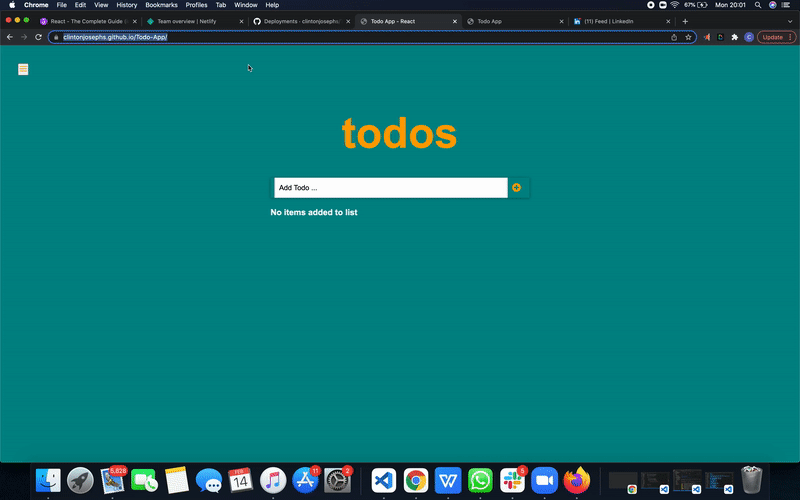

# Todo-App



[Demo Link - gh-pages](https://clintonjosephs.github.io/Todo-App)

> Todo App is a single page application (SPA) for listing tasks. These tasks are stored in the local storage and can be marked as completed, edited and deleted. It is built using React, HTML and CSS.


Additional description about the project and its features.

## Built With

- Major languages (HTML, CSS, JavaScript)

- Frameworks / Libraries
  ```bash
  - React Library
  ```

- Technologies used 
  
  ``` bash
  - Git(version control)
  ```


## Getting Started

To get a local copy up and running follow these simple example steps.

### Prerequisites
 - A text editor(preferably Visual Studio Code)

### Install
  -  [Git](https://git-scm.com/downloads)
  -  [Node](https://nodejs.org/en/download/)

### Usage
#### Clone this repository

```bash
$ git@github.com:clintonjosephs/Todo-App.git
$ cd Todo-App
```
#### Run project

```bash
$ npm install
$ npm build
$ npm start
```

#### Open page in browser
```bash
$ runs on http://localhost:3001/
```

## Authors

👤 **Clinton Mbonu**

- GitHub: [@clintonjosephs](https://github.com/clintonjosephs)
- LinkedIn: [LinkedIn](https://linkedin.com/in/clinton-mbonu)

## 🤝 Contributing

Contributions, issues, and feature requests are welcome!

Feel free to check the [issues page](https://github.com/clintonjosephs/Todo-App/issues).

## Acknowlegments
[React Tutorial From Scratch: A Step-by-Step Guide (2021)](https://ibaslogic.com/react-tutorial-for-beginners/)

## Show your support

Give a ⭐️ if you like this project!

## 📝 License

This project is [MIT](https://opensource.org/licenses/MIT) licensed.